# HashiePussegoda_T1A2

## Link to Portfolio Website: 
<!-- add link later -->

Here's a [link](https://gracious-davinci-763d83.netlify.app) to my portfolio website.

## Link to GitHub Repo:

Here's a [link](https://github.com/Devbreaker29/HashiePussegoda_T1A2) to my GitHub repo.

## Description of Portfolio Website: 

### Purpose

 I built this website for personal branding purposes.

### Functionality / features

  - #### Project Name

    Portfolio Website

  - #### Description
    - The website was made mainly to promote my personal   
           brand in the tech industry.
    - And connect with potential employers.
   
  - #### Contents
     This project is constructed with 7 HTML files: 

     - index.html
     - journey.html
     - projects.html
     - workhistory.html
     - interest.html
     - goals.html
     - contact.html

     And 1 CSS file: 

     - style.css
     
    The tab has 7 nav icons: 

     - Home
     - My Journey
     - My Projects & Coding Courses
     - My Work History
     - My Interest 
     - Future Ideas 
     - Contact

     There are 7 tabs in the nav bar.

     Below are the basic features and contents of each page.

|Page|Contents|
|---|---|
|Home|Gives an introduction of the website and who I am.|
|My Journey|Gives a description of my journey in relation to Education and how it relates to coding|
|My Projects & Coding Courses|Shows skills I have gained and various coding courses I have done.|
|My Work History|Shows my Work History.|
|My Interest|Shows my Interests|
|Future Ideas|Shows Goals with Blog Posts|
|Contact|Shows Contact Section|

### Sitemap
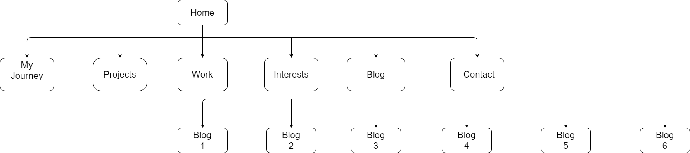

### Screenshots

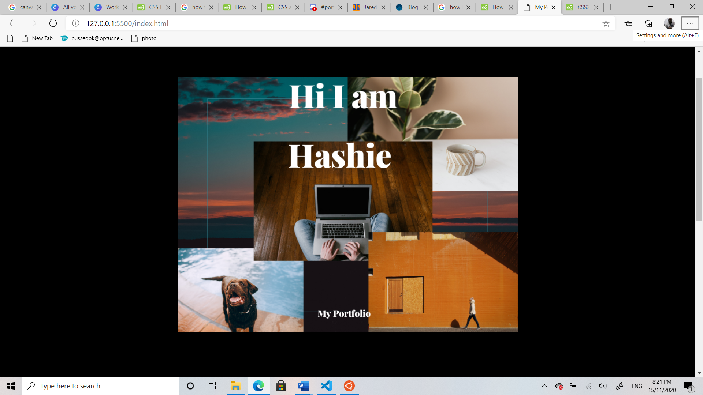
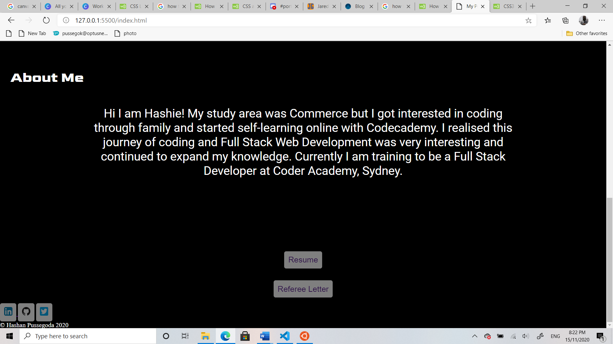
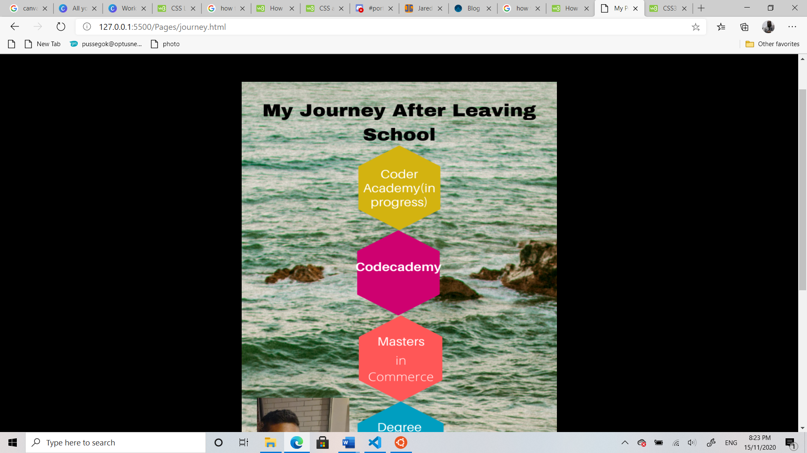
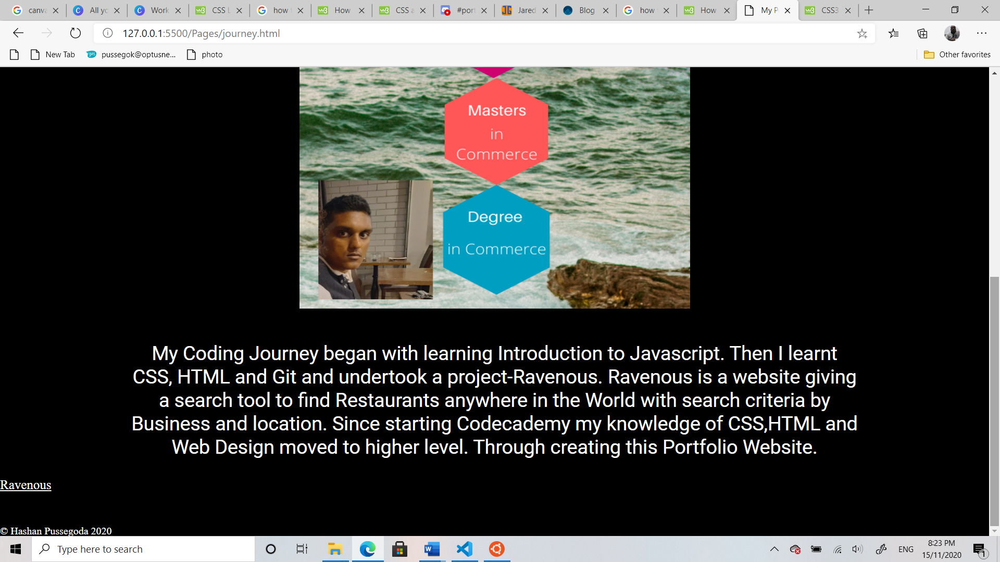
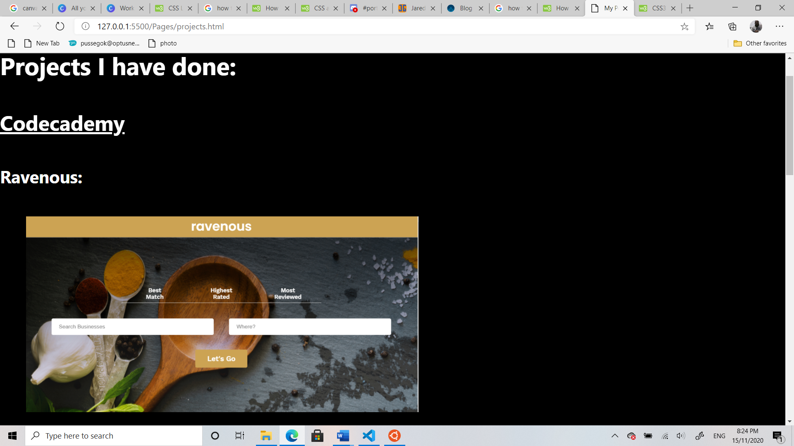
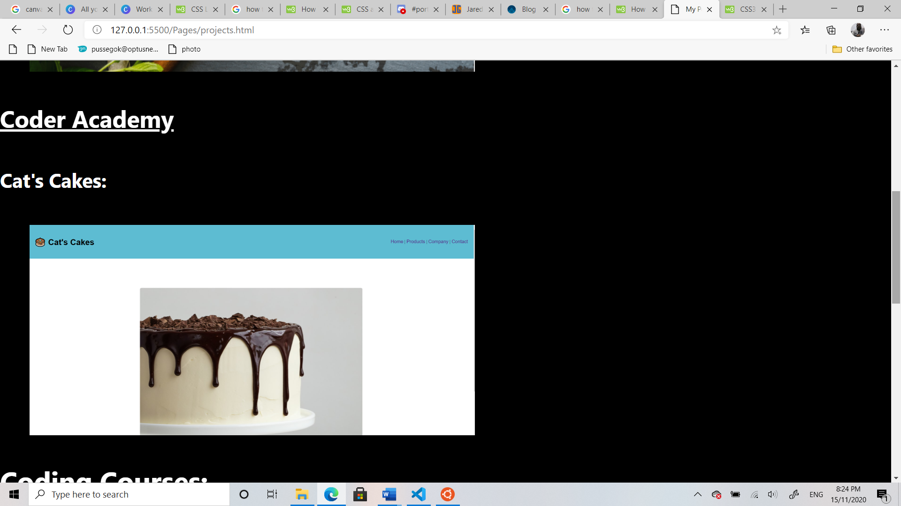
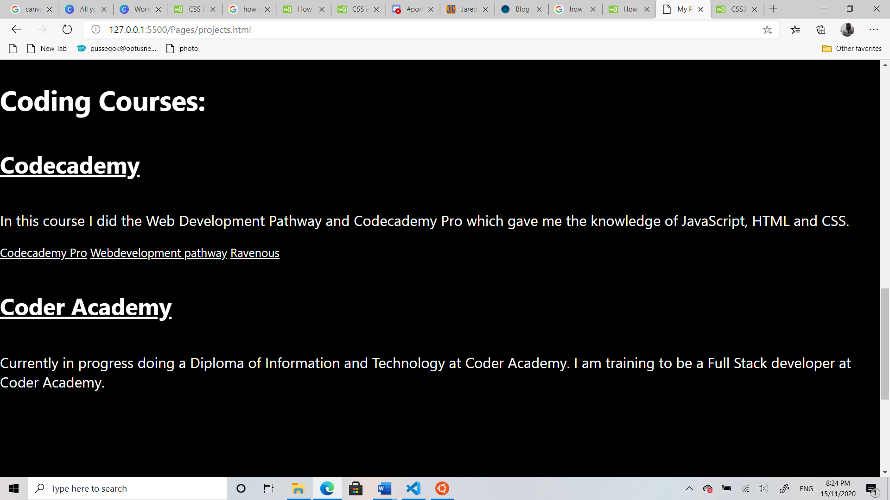
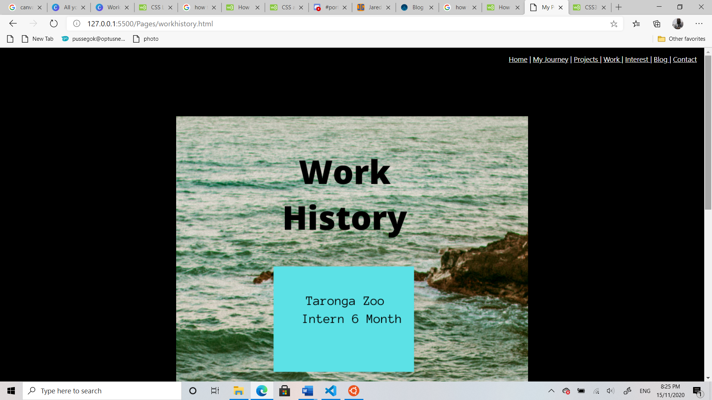
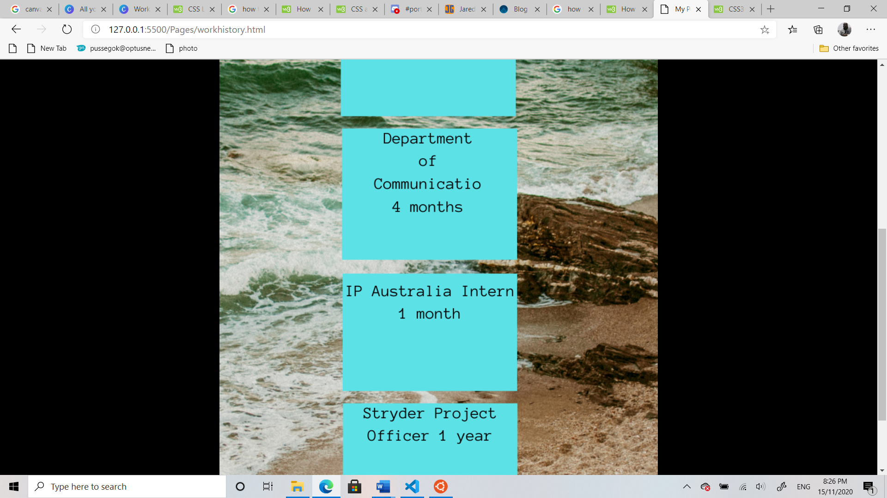
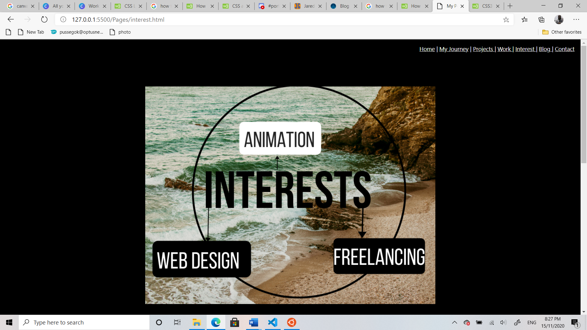
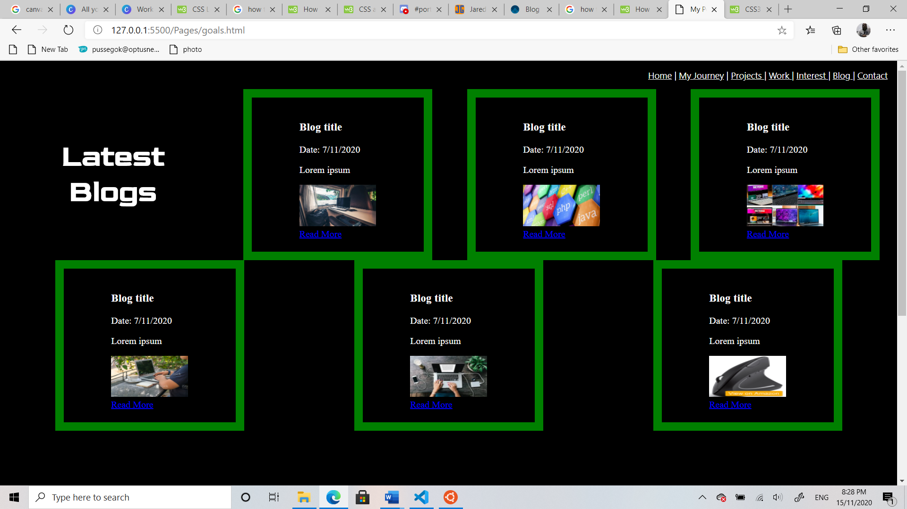
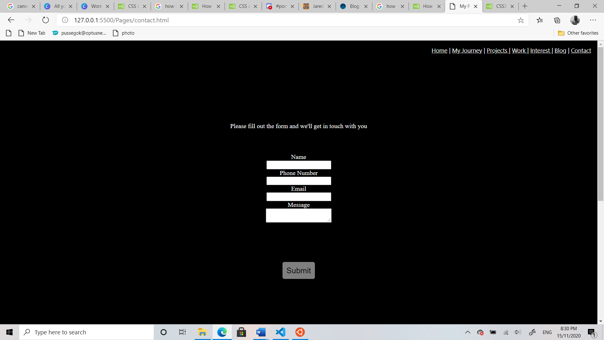

### Target audience

Potential Employers and people in the Tech Industry.

### Tech stack 

I used HTML, CSS and Git.
